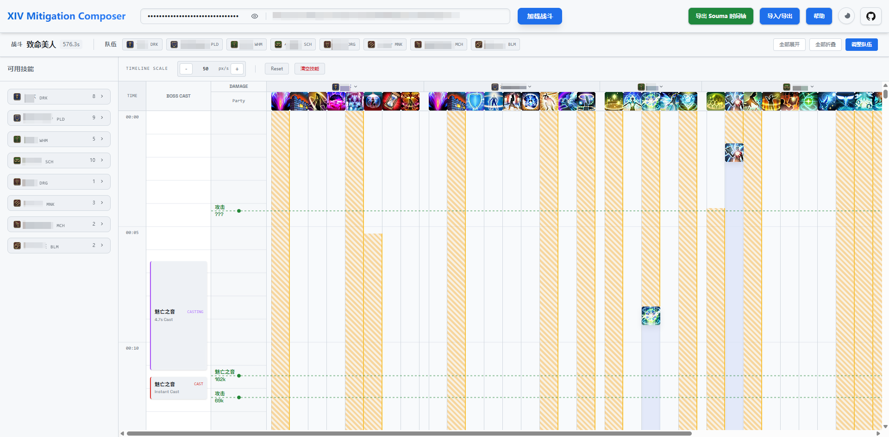
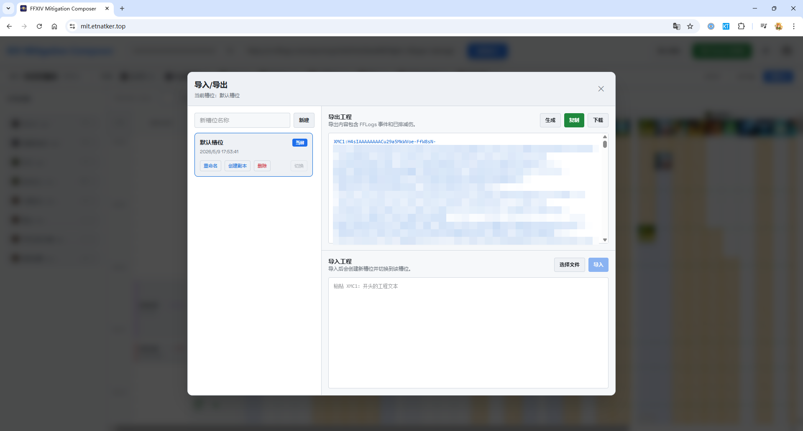
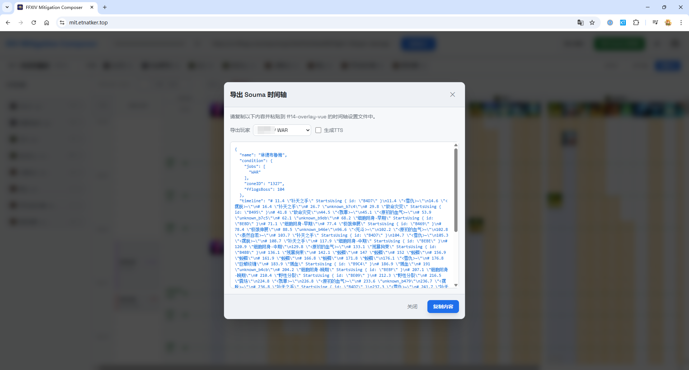

# FFXIV Mitigation Composer (最终幻想14 减伤排轴器)

这是一个用于规划最终幻想14（FFXIV）战斗减伤策略的网页工具。应用通过 FFLogs 报告加载战斗信息、玩家事件、Boss 咏唱和受击事件，并提供纵向时间轴来编排全队减伤。


直接访问：[FFXIV Mitigation Composer](https://etnatker.github.io/xiv-mit-composer/)

## 特性

- **FFLogs 战斗加载**：输入 FFLogs API Key 和报告 URL 后加载战斗元数据、Boss 咏唱、玩家受击和已有友方减伤事件。
- **纵向可视化时间轴**：沿袭传统 Excel 排轴习惯，按时间纵向浏览，展示 Boss 咏唱、全局受击、玩家技能列和减伤覆盖。
- **全队排轴**：支持最多 8 个队伍成员，可添加真实玩家或空白职能，重复职业拥有独立技能列和独立冷却。
- **拖拽与批量编辑**：支持从技能栏拖入减伤、移动已有减伤、框选、多选移动、右键编辑、快捷键删除和拖入删除区。
- **冷却校验与覆盖提示**：按技能、共享冷却组和释放者校验冷却，时间轴中显示不可用区间（黄）、技能冷却区间（灰）和冲突技能投影。
- **保存与加载**：浏览器本地保存多个工程槽位，支持新建、复制、重命名、切换、删除、导入和导出 `.xmc` 工程文件。
- **Souma 时间轴导出**：支持按玩家导出 Souma 时间轴 JSON，并可选择生成 TTS 文本。







> [!WARNING]
> **早期开发阶段 (Early Access)**
>
> 本项目仍处于早期开发阶段，功能和数据仍在持续完善：
>
> - 技能数据和覆盖语义仍在持续完善；
> - 仍可能存在影响使用的 Bug，请在实际使用前自行核对排轴结果。

## 技术栈

- **前端框架**: [React](https://react.dev/)
- **构建工具**: [Vite](https://vitejs.dev/)
- **语言**: [TypeScript](https://www.typescriptlang.org/)
- **样式**: [Tailwind CSS](https://tailwindcss.com/)
- **状态管理**: [Zustand](https://github.com/pmndrs/zustand)
- **拖拽库**: [@dnd-kit](https://dndkit.com/)

## 文档

项目文档位于 [docs](docs/index.md)。文档索引介绍整体架构、各文档文件用途和文档维护规约。

## 使用说明

1.  **加载数据**：
    - 需要一个有效的 FFLogs API Key (V1)。
    - 输入 FFLogs 报告 URL，例如 `https://cn.fflogs.com/reports/...?...fight=...`。
    - URL 中缺少 `fight` 参数时，应用使用报告中的最后一场战斗。
    - 点击 **加载战斗**。

2.  **选择队伍**：
    - 加载元数据后，在玩家选择窗口中选择最多 8 个成员。
    - 可以添加报告中的真实玩家，也可以添加一个空白职能用于手动排轴。
    - 可以调整队伍顺序；顺序会影响时间轴中的玩家分组排列。

3.  **排轴操作**：
    - **添加减伤**：从左侧技能栏将减伤技能拖拽到右侧时间轴上。
    - **调整位置**：拖拽已有减伤条以调整释放时间。多选状态下拖拽其中一个减伤条会整体移动选中项。
    - **编辑事件**：右键单击减伤条可以编辑时间或删除事件。
    - **选择与删除**：在时间轴中框选减伤条，按 `Delete` 或 `Backspace` 删除选中项；也可以把已有减伤拖入删除区。
    - **缩放视图**：按住 `Alt` + 滚轮缩放时间轴，也可以使用时间轴工具栏调整 `px/s`。
    - **折叠分组**：战斗信息栏提供全部展开、全部折叠和调整队伍入口。
    - **冷却标识**：黄色区间表示当前技能不可用，灰色区间表示技能冷却占用，冲突技能投影用于提示同一时间附近的互斥或冲突排布。

4.  **工程导入导出**：
    - 点击 **导入/导出** 打开工程管理弹窗。
    - 当前工程会自动保存到浏览器本地槽位。
    - 可以新建、复制、重命名、删除和切换槽位。
    - 可以生成 `XMC1:` 开头的工程文本，复制或下载为 `.xmc` 文件。
    - 导入工程文本或 `.xmc` 文件会创建一个新槽位并切换到该槽位。

5.  **导出 Souma 时间轴**：
    - 点击 **导出 Souma 时间轴** 打开导出弹窗。
    - 选择要导出的玩家。
    - 按需勾选 **生成TTS**。
    - 复制生成的 JSON，并粘贴到 Souma / ff14-overlay-vue 的时间轴设置文件中。

## 开发

本项目使用 `bun` 管理依赖、运行脚本和执行验证。

### 1. 安装依赖

```bash
bun install
```

获取 XIV 图标资源：

```bash
bun run fetch:icons
```

按职业获取技能候选数据：

```bash
bun run fetch:skills -- SGE
```

### 2. 本地开发

启动开发服务器：

```bash
bun run dev
```

### 3. 验证与构建

运行 ESLint：

```bash
bun run lint
```

运行测试：

```bash
bun test
```

构建生产环境版本：

```bash
bun run build
```

## 作者（按第一次PR时间排序）

- [etnAtker](https://github.com/etnAtker)

  编写了初版应用。

- [Loskh](https://github.com/Loskh)

  提供了多项改进提案和其实现，如框选，可堆叠技能支持等。

- [subjadeites](https://github.com/subjadeites)

  巨量代码重构，大量UI翻新，和其他非常多的新功能。

- [Slob](https://github.com/BeginnerSlob)

  技能数据提供、修正。

## 致谢

本项目的启动在很大程度上受到了 @Souma-Sumire 的项目 [ff14-overlay-vue](https://github.com/Souma-Sumire/ff14-overlay-vue) 以及相关 [Issue](https://github.com/Souma-Sumire/ff14-overlay-vue/issues/2) 的启发；实现过程中亦参考并借鉴了 @Souma-Sumire 的时间轴处理代码。
